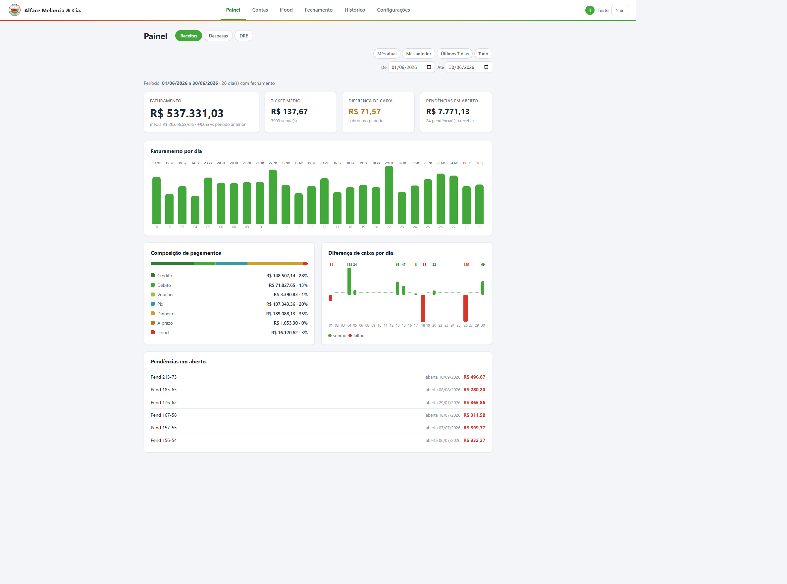
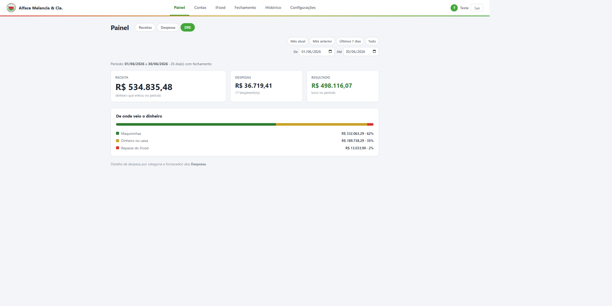
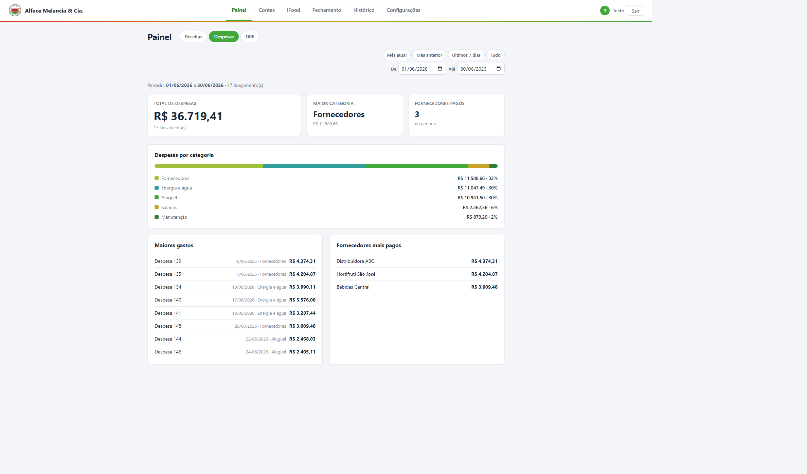

# Fechamento de Caixa

Sistema de conciliação financeira usado diariamente por uma mercearia real. Ele cruza o que o PDV registrou com o dinheiro que de fato entrou, aponta onde não bateu e explica o porquê. Além do fechamento diário, controla despesas, contas a receber, repasses de delivery e gera o DRE do período.

Está em produção desde 2026, rodando no computador do balcão.



## O problema

O relatório do PDV quase nunca fecha com o dinheiro na gaveta. As causas são diferentes entre si e exigem tratamentos diferentes:

- **Erro de classificação**: a venda foi no crédito mas registraram como pix
- **Troco em moeda**: moedas não são contadas todo dia e somem da conta aos poucos
- **Pendência**: o cliente levou a mercadoria e passou o cartão só no dia seguinte
- **Fiado e delivery**: dinheiro que entra dias ou semanas depois da venda

Antes, o fechamento era feito na mão, no papel: somar as maquininhas, contar o caixa, comparar com o PDV e tentar lembrar quem ficou devendo. Levava cerca de **45 minutos por dia** e, quando a conta não fechava, não havia como saber qual das causas tinha provocado a diferença.

## O que mudou

O fechamento passou de **45 para cerca de 5 minutos**, com o relatório saindo impresso automaticamente na térmica ao fim do processo.

Mais importante que o tempo: a diferença agora vem decomposta. Em vez de um número solto no fim do dia, o sistema mostra quanto veio de pendência aberta, quanto de recebimento antigo, quanto de ajuste manual, e quanto sobrou sem explicação. Só esse resto é que precisa de investigação.

## Como a conciliação funciona

Duas conferências independentes, que nunca se misturam.

**Dinheiro**

```
Esperado  = abertura + suprimento − sangrias + dinheiro do PDV
Contado   = cédulas contadas no fechamento, ajustadas
Diferença = contado − esperado        (− faltou · + sobrou)
```

Diferença abaixo de um limite configurável é sinalizada como provável troco em moeda, separando o ruído esperado do que merece atenção.

**Cartão e pix**

Comparados sempre pelo total geral, nunca categoria por categoria. Como a causa mais comum de divergência é justamente o erro de classificação, comparar crédito contra crédito esconderia o erro: o que falta numa categoria sobra na outra.

```
Real         = soma (cartão + pix) das máquinas + pix na chave direta
Pendência aberta hoje    → soma de volta (a venda não passou na maquininha)
Pendência recebida hoje  → entra no lado que recebeu, dinheiro ou cartão
A prazo recebido hoje    → mesma regra

Diferença = real ajustado − total do PDV
```

Venda a prazo e venda por delivery ficam fora da conferência do dia. O que entra é o **recebimento** delas, no dia em que o dinheiro chega, e não a venda original.

## Regime de caixa e regime de competência

O sistema mantém as duas visões, e a diferença entre elas é o ponto central do modelo:

| | Pergunta que responde | Onde aparece |
|---|---|---|
| **Competência** | Quanto eu vendi? | Painel → Faturamento |
| **Caixa** | Quanto dinheiro entrou? | Painel → DRE → Receita |

Uma venda fiada entra no faturamento no dia da venda, mas só entra na receita quando o cliente paga. Um repasse de delivery entra na receita no dia em que cai na conta, semanas depois das vendas que o originaram. Os dois números são corretos e não precisam bater. O sistema deixa isso explícito em vez de esconder.



## Telas

| Tela | O que faz |
|---|---|
| **Fechamento do dia** | Tela principal. Lança PDV, maquininhas, dinheiro por caixa, sangrias, ajustes, pendências e recebimentos. As duas conferências recalculam enquanto digita. Fecha o dia e imprime. |
| **Painel** | Receitas (faturamento, ticket médio, diferença de caixa, composição de pagamentos), Despesas (por categoria, maiores gastos, fornecedores) e DRE. |
| **Contas** | Despesas por categoria e fornecedor, com edição e exclusão. |
| **iFood** | Repasses do delivery, comparando o bruto vendido no período com o líquido recebido para calcular a taxa retida. |
| **Histórico** | Fechamentos por data. Editar um dia já fechado é permitido, mas fica registrado em log. |
| **Configurações** | Versão e atualização do sistema, backup, cadastros e operadores. |



## Decisões técnicas

**Fonte única para a lógica financeira.** `src/utils/calculos.js` é importado tanto pelo Express quanto pelo React. Servidor e tela não têm como calcular diferente, porque executam a mesma função.

**Histórico imutável.** Os totais e diferenças de um fechamento são gravados no momento em que o dia é fechado, não recalculados na leitura. Mudar uma configuração hoje não reescreve o passado.

**Migrações aditivas.** O schema só cria tabelas e adiciona colunas, nunca remove. Colunas de funcionalidades descontinuadas continuam no banco, apenas deixam de ser lidas. Abrir um banco antigo numa versão nova é seguro.

**SQLite via WebAssembly.** O banco usa [sql.js](https://sql.js.org), SQLite compilado para WASM, em vez de um driver nativo. A máquina de destino bloqueia binários não assinados, o que inviabiliza `better-sqlite3` e Electron. O banco vive em memória e é exportado para o arquivo `.db` a cada escrita, com gravação atômica.

## Testes

```
npm test                  # 20 testes unitários das fórmulas financeiras
npm run test:integracao   # 468 lançamentos, 3165 asserções
```

O teste de integração sobe um servidor com banco temporário, popula 215 dias de fechamento, 75 pendências, 32 recebimentos a prazo, 130 despesas e 16 repasses, e confere cada valor gravado.

A parte que importa: **a matemática esperada é reimplementada dentro do próprio teste**, a partir da especificação, sem importar `calculos.js`. Um erro de fórmula não consegue se esconder por estar dos dois lados da comparação. Os valores são gerados em centavos inteiros por um PRNG de seed fixa, então cada execução produz exatamente os mesmos números e qualquer falha é reproduzível.

Foi assim que apareceu o bug mais sério do projeto: a receita do DRE estava somando o fundo de troco do caixa como se fosse venda, inflando o lucro do período inteiro.

## Operação remota

A loja fica longe e o computador é usado por quem não mexe em tecnologia. Duas funções resolvem isso:

**Atualização pelo botão.** Em Configurações, "Verificar atualizações" consulta o repositório; havendo novidade, "Atualizar agora" roda `git pull`, reinstala dependências se necessário, recompila e reinicia o servidor, mostrando o log na tela. Não exige ida presencial nem conhecimento técnico de quem opera.

**Backup automático.** Toda sexta o banco é enviado para uma pasta no Google Drive. Se o computador estiver desligado no horário, o backup roda na próxima abertura.

Existe ainda `npm run diagnostico`, que verifica se a atualização remota vai funcionar numa máquina (git instalado, pasta é um clone de verdade, acesso ao repositório, permissão de escrita, compilação) sem alterar nada. Serve para descobrir o problema na instalação, e não meses depois.

## Stack

React e Vite no front, Express no back, sql.js como banco. ESM em todo o projeto, sem TypeScript, sem biblioteca de estado, sem framework de UI. Gráficos são SVG e CSS escritos à mão.

## Modelo de dados

Dez tabelas: `fechamentos` (valores digitados e calculados), `pendencias` (abertura e recebimento, com a forma de pagamento), `a_prazo_recebimentos`, `ifood_repasses`, `despesas`, `categorias_despesa`, `fornecedores`, `usuarios`, `configuracoes` e `log_edicoes`.

## Rodando

```bash
npm install
npm run dev      # front com HMR em :5173, proxy /api para :3001
npm run server   # API em :3001
```

Para uso local em produção:

```bash
npm run build
npm run iniciar
```

Configuração via `.env` (veja `.env.example`): `PORT`, `DB_PATH`, `ABRIR_NAVEGADOR` e, opcionalmente, as credenciais OAuth do Google Drive para o backup.

## Estrutura

```
server/
├── index.js        Express, injeta o banco nas rotas, agenda o backup
├── db.js           sql.js, gravação atômica em disco
├── backup.js       upload para o Google Drive
├── schema.sql      DDL, aplicado de forma idempotente no boot
└── routes/         fechamentos, pendencias, aPrazo, despesas, ifood,
                    usuarios, configuracoes, sistema

src/
├── pages/          Login, Fechamento, Painel (Receitas/Despesas/DRE),
│                   Contas, IFood, Historico, Configuracoes
├── components/     CampoValor, Conferencia, RelatorioImpressao
└── utils/
    ├── calculos.js     lógica financeira, compartilhada com o servidor
    ├── formatacao.js
    └── relatorio.js    relatório da impressora térmica

tests/
├── integracao.test.mjs   468 lançamentos, 3165 asserções
└── diagnostico.mjs       checagem pré-instalação
```
